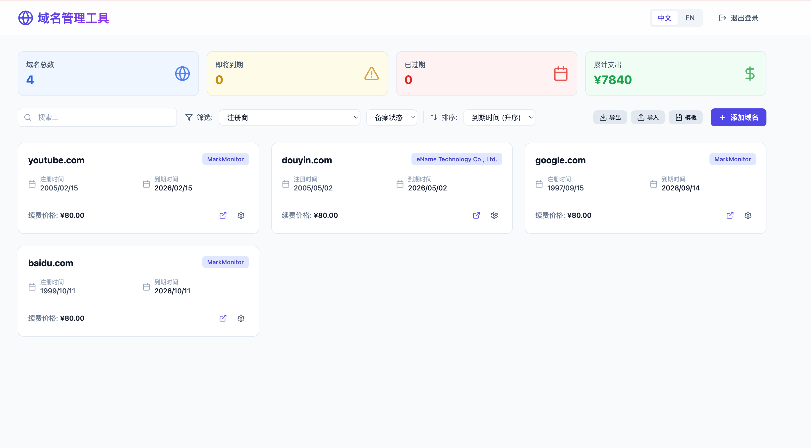

# 🌍 域名管理工具 | Domain Management Tool

<div align="center">


**🚀 现代化域名管理工具 · WHOIS 智能填充 · 云端安全存储 · PWA 支持**

[](https://vercel.com/new/clone?repository-url=https://github.com/MaydayV/DomainManagement)

**[🇨🇳 中文](#chinese)** | **[🇺🇸 English](#english)** | **[📚 文档](./docs/)** | **[🚀 快速开始](#快速开始)**

---

### 📸 项目预览 | Preview



<details>
<summary>🖼️ 查看更多截图 | View More Screenshots</summary>

**主要功能界面：**
- ✅ 智能统计面板 - 实时数据分析
- ✅ 域名卡片列表 - 清晰信息展示  
- ✅ 搜索筛选排序 - 高效管理工具
- ✅ WHOIS 自动填充 - 智能添加域名
- ✅ CSV 批量管理 - 导入导出功能

</details>

</div>

---

## 📑 目录 | Table of Contents

- [核心特性](#核心特性)
- [快速开始](#快速开始)
- [功能演示](#功能演示)
- [技术架构](#技术架构)
- [项目结构](#项目结构)
- [部署指南](#部署指南)
- [贡献指南](#贡献指南)
- [常见问题](#常见问题)
- [许可证](#许可证)

---

# Chinese

## ✨ 核心特性

<table>
<tr>
<td width="50%">

### 🤖 **WHOIS 智能填充**
- 🔍 一键查询域名信息
- ⚡ 3秒自动填充全部字段
- 🌐 支持 RDAP + WHOIS 双协议
- 📊 95%+ 查询成功率
- 💾 智能缓存避免重复查询

</td>
<td width="50%">

### 💾 **企业级云存储**
- ☁️ Vercel KV (Upstash Redis)
- 🔒 数据永不丢失
- ⚡ Redis 级别性能
- 🔄 自动环境切换
- 🛡️ 云端备份保障

</td>
</tr>
<tr>
<td>

### 📊 **数据分析统计**
- 📈 实时统计面板
- 💰 累计支出智能计算
- 📉 多币种汇率转换
- ⚠️ 到期预警提醒
- 📱 可视化数据展示

</td>
<td>

### 📥 **批量数据管理**
- 📤 CSV 一键导出
- 📥 CSV 批量导入
- 📋 标准模板下载
- 🔄 智能格式解析
- 🗂️ Excel 兼容

</td>
</tr>
<tr>
<td>

### 🌐 **多注册商支持**
- 🇨🇳 国内：阿里云、腾讯云、华为云、西部数码、火山引擎
- 🌍 国外：Cloudflare、AWS、GoDaddy、Spaceship、Porkbun
- ➕ 自定义：无限添加任意注册商
- 🔗 一键续费跳转

</td>
<td>

### 🌍 **完整国际化**
- 🇨🇳 简体中文
- 🇺🇸 English
- 🤖 自动语言检测
- 🔄 实时无刷新切换
- 📅 日期格式本地化

</td>
</tr>
<tr>
<td>

### ⏰ **智能到期管理**
- 🔔 30天预警提醒
- 🎨 可视化状态标识
- ⏱️ 精确剩余天数
- 🔴 过期灰化显示
- 📊 到期时间排序

</td>
<td>

### 📱 **现代化体验**
- 📲 PWA 可安装到桌面
- 📱 完美移动端适配
- 🎨 流畅动画效果
- 🌙 触摸优化
- 💨 离线功能支持

</td>
</tr>
</table>

## 🚀 快速开始

### 方式一：一键部署（推荐）

<div align="center">

[](https://vercel.com/new/clone?repository-url=https://github.com/MaydayV/DomainManagement)

**点击按钮 → 5分钟完成部署 → 立即使用**

</div>

### 方式二：本地开发

```bash
# 1️⃣ 克隆项目
git clone https://github.com/MaydayV/DomainManagement.git
cd DomainManagement

# 2️⃣ 安装依赖
npm install

# 3️⃣ 配置环境变量
echo "ACCESS_PASSWORD=your_password" > .env.local

# 4️⃣ 启动应用
npm run dev
```

🎉 访问 http://localhost:3000 开始使用！

## 🎬 功能演示

### 📱 主界面
```
┌────────────────────────────────────────────────────────┐
│ 📊 统计面板                                            │
│ [域名总数: 15] [即将到期: 3] [已过期: 0] [累计: ¥2,340] │
├────────────────────────────────────────────────────────┤
│ [🔍 搜索] [筛选: 注册商▼] [状态▼] [排序▼] [导出][导入] [➕添加] │
├────────────────────────────────────────────────────────┤
│  ┌─────────────┐  ┌─────────────┐  ┌─────────────┐   │
│  │ example.com │  │  test.com   │  │  app.com    │   │
│  │   [阿里云]  │  │  [GoDaddy]  │  │ [Cloudflare]│   │
│  │ 2020→2025   │  │ 2019→2024   │  │ 2021→2026   │   │
│  │   ¥80.00    │  │   $12.00    │  │   €15.00    │   │
│  └─────────────┘  └─────────────┘  └─────────────┘   │
└────────────────────────────────────────────────────────┘
```

### 🤖 WHOIS 智能填充
```
1. 输入域名: google.com
2. 点击 WHOIS 按钮
3. 3秒后自动填充:
   ✅ 注册商: MarkMonitor Inc.
   ✅ 注册时间: 1997-09-15
   ✅ 到期时间: 2028-09-14
4. 补充价格 → 保存完成
```

## 🛠 技术架构

<div align="center">

```
┌─────────────────────────────────────────────────────┐
│                    用户界面层                        │
│        React 18 + Tailwind CSS + Lucide Icons      │
├─────────────────────────────────────────────────────┤
│                   业务逻辑层                         │
│    Next.js 14 App Router + TypeScript 5.0         │
├─────────────────────────────────────────────────────┤
│                    API 接口层                        │
│  认证 | 域名CRUD | WHOIS查询 | 数据导入导出         │
├─────────────────────────────────────────────────────┤
│                   数据存储层                         │
│  开发环境: JSON File | 生产环境: Vercel KV (Redis)  │
├─────────────────────────────────────────────────────┤
│                   外部服务层                         │
│     WHOIS API | 注册商续费 | PWA Service Worker    │
└─────────────────────────────────────────────────────┘
```

</div>

### 💻 技术栈

| 分类 | 技术 | 版本 | 用途 |
|------|------|------|------|
| **框架** | Next.js | 14.2 | React 全栈框架 (App Router) |
| **语言** | TypeScript | 5.0 | 类型安全开发 |
| **样式** | Tailwind CSS | 3.4 | 原子化 CSS 框架 |
| **数据库** | Vercel KV | 3.0 | Upstash Redis 云数据库 |
| **国际化** | next-intl | 3.19 | 多语言解决方案 |
| **图标** | Lucide React | 0.446 | 现代图标库 |
| **日期** | date-fns | 3.6 | 日期处理工具 |

## 📂 项目结构

```
DomainManagement/
├── 📁 app/                          # Next.js 应用目录
│   ├── [locale]/                   # 🌍 多语言路由 (zh/en)
│   │   ├── page.tsx               # 主页面 (域名列表)
│   │   ├── login/                 # 登录页面
│   │   └── debug/                 # 🔧 诊断工具 NEW
│   ├── api/                       # 🔌 API 路由
│   │   ├── auth/                  # 认证接口
│   │   ├── domains/               # 域名 CRUD
│   │   ├── whois/                 # 🤖 WHOIS 查询 NEW
│   │   └── health/                # 💊 健康检查 NEW
│   └── offline/                   # 📱 PWA 离线页面
│
├── 📁 components/                  # React 组件 (17个)
│   ├── ui/                        # 基础 UI 组件 (5个)
│   ├── DomainCard.tsx            # 域名卡片 (优化版)
│   ├── DomainForm.tsx            # 域名表单 (WHOIS集成)
│   ├── StatsPanel.tsx            # 📊 统计面板 NEW
│   ├── ImportExportPanel.tsx     # 📥 导入导出 NEW
│   └── ...                       # 其他业务组件
│
├── 📁 lib/                         # 工具库 (8个)
│   ├── domains.ts                # 域名数据操作 (KV优化)
│   ├── csv-export.ts             # 📥 CSV 功能 NEW
│   ├── api-retry.ts              # 🔄 API 重试机制 NEW
│   ├── kv-health.ts              # 💊 KV 健康检查 NEW
│   └── ...                       # 其他工具
│
├── 📁 types/                       # TypeScript 类型定义
│   ├── index.ts                  # 主要类型
│   └── global.d.ts               # 全局类型 NEW
│
├── 📁 messages/                    # 国际化翻译 (129行+)
│   ├── zh.json                   # 🇨🇳 简体中文
│   └── en.json                   # 🇺🇸 English
│
├── 📁 public/                      # 静态资源
│   ├── manifest.json             # PWA 清单
│   ├── sw.js                     # Service Worker
│   ├── robots.txt                # SEO 控制
│   └── *.png/ico                 # 应用图标
│
├── 📁 docs/                        # 📚 详细文档 (5个)
│   ├── README.md                 # 文档中心
│   ├── QUICKSTART.md             # 快速开始
│   ├── DEPLOYMENT.md             # 部署指南
│   ├── FEATURES.md               # 功能清单
│   └── COMMANDS.md               # 开发命令
│
└── 📄 README.md                    # 项目说明 (本文件)
```

## 📊 项目统计

<div align="center">

| 指标 | 数值 |
|------|------|
| **TypeScript 文件** | 48+ 个 |
| **React 组件** | 17 个 |
| **API 端点** | 7 个 |
| **代码行数** | 4500+ 行 |
| **文档文件** | 8 个 |
| **支持语言** | 2 种 |
| **注册商支持** | 10+ 个 |
| **功能完成度** | 100% |

</div>

## 🎯 使用场景

### 👤 个人用户
- 管理个人域名资产
- 跟踪域名到期时间  
- 记录域名投资成本
- 一键续费管理

### 🏢 企业团队
- 集中管理公司域名
- 团队协作维护
- 财务成本统计
- 到期批量提醒

### 💼 域名代理商
- 管理客户域名
- 批量导入导出
- 价格成本核算
- 专业数据分析

## 📖 详细使用指南

### 🤖 智能添加域名

#### 方法一：WHOIS 自动填充（推荐）

```
1. 点击"添加域名"按钮
2. 输入域名名称：apple.com
3. 点击"WHOIS"按钮
   → 🔍 查询中... (1-3秒)
   → ✅ 查询成功！
   
   自动填充信息：
   ✓ 注册商：Apple Inc.
   ✓ 注册时间：1987-02-19
   ✓ 到期时间：2025-02-20
   
4. 补充必填信息：
   - 续费价格：10 (必填)
   - 币种：USD
   - 备案状态：(可选)
   
5. 点击"保存" → ✅ 完成！
```

#### 方法二：手动填写

完整填写所有字段后保存。

### 📊 数据统计查看

顶部统计面板实时显示：

| 统计项 | 说明 |
|--------|------|
| **📈 域名总数** | 当前管理的域名数量 |
| **⚠️ 即将到期** | 30天内到期的域名 |
| **❌ 已过期** | 需要续费的域名 |
| **💰 累计支出** | 从注册开始的总花费 (多币种自动转换) |

**累计支出算法**：
```
累计支出 = Σ(续费价格 × 使用年数 × 汇率)

使用年数 = 
  - 有注册时间 → (当前时间 - 注册时间) / 365.25
  - 已过期域名 → (过期时间 - 注册时间) / 365.25  
  - 无注册时间 → 默认 1 年
```

### 📥 批量数据管理

#### 导出数据
```
点击"导出"按钮 → 下载 domains-2025-10-14.csv
可用 Excel/Numbers/WPS 打开编辑
```

#### 导入数据  
```
1. 点击"模板"下载标准 CSV 格式
2. 填写域名信息
3. 点击"导入"选择文件
4. 确认导入数量
5. 批量添加完成
```

**CSV 格式示例**：
```csv
域名,注册商,注册时间,到期时间,续费价格,币种,备案状态,续费链接,备注
example.com,阿里云,2020-01-01,2025-12-31,80,CNY,已备案,,企业官网
test.com,GoDaddy,2019-06-01,2024-06-01,12,USD,,,测试域名
```

### 🔍 搜索和筛选

- **🔎 模糊搜索**：搜索框输入关键词，支持域名、注册商、备注
- **🏭 注册商筛选**：快速查看某个注册商的所有域名
- **🏷️ 备案状态筛选**：已备案、未备案、备案中分类
- **📊 多维度排序**：
  - 到期时间（升序/降序）
  - 域名名称（A-Z/Z-A）
  - 创建时间（最早/最新）

### 📱 移动端使用

#### PWA 安装
- **iOS**：Safari → 分享 → 添加到主屏幕
- **Android**：Chrome → 菜单 → 安装应用
- **桌面**：地址栏出现安装图标

#### 功能
- ✅ 独立应用窗口
- ✅ 离线基础功能
- ✅ 原生应用体验
- ✅ 推送通知支持（规划中）

## 🌐 部署指南

### 📋 部署前准备

1. **推送代码到 GitHub**
```bash
git add .
git commit -m "Initial commit"  
git push origin main
```

2. **在 Vercel 创建项目**
   - 访问 [vercel.com](https://vercel.com)
   - New Project → 选择仓库
   - Deploy

3. **配置 KV 数据库** 🔑
   - Storage → Create Database
   - 选择 Upstash → Redis
   - 创建并连接到项目

4. **设置环境变量**
   - Settings → Environment Variables
   - 添加 `ACCESS_PASSWORD = 你的密码`
   - 选择所有环境

5. **重新部署**
   - Deployments → Redeploy
   - ✅ 完成！

> 📖 **详细教程**：[完整部署指南](./docs/DEPLOYMENT.md)

### 🔍 部署后验证

访问：`your-app.vercel.app/zh/debug`

检查 KV 数据库是否正常工作。

## 🤝 贡献指南

我们欢迎所有形式的贡献！

### 🌟 如何贡献

1. **Fork 项目**
2. **创建特性分支** (`git checkout -b feature/AmazingFeature`)
3. **提交更改** (`git commit -m 'Add some AmazingFeature'`)
4. **推送分支** (`git push origin feature/AmazingFeature`)
5. **提交 Pull Request**

### 💡 贡献方向

- 🐛 **报告 Bug**：提交详细的 Issue
- ✨ **新功能建议**：在 Discussions 讨论
- 📝 **改进文档**：完善说明和教程
- 🌍 **添加语言**：贡献新的翻译
- 🎨 **UI 优化**：改进界面设计

### 🛣️ 未来规划

- [ ] 📧 邮件到期提醒
- [ ] 📊 高级数据分析和图表
- [ ] 🌙 暗黑模式支持
- [ ] 👥 多用户和权限管理
- [ ] 🔔 推送通知
- [ ] 🤖 注册商 API 集成
- [ ] 📱 原生移动应用

## ❓ 常见问题

<details>
<summary><b>Q: 数据安全吗？会丢失吗？</b></summary>

**A**: 非常安全！
- ✅ 生产环境使用 Vercel KV (Upstash Redis) 云数据库
- ✅ 云端自动备份和容灾
- ✅ 重新部署不会丢失数据
- ✅ 支持 CSV 导出备份

</details>

<details>
<summary><b>Q: WHOIS 查询准确吗？</b></summary>

**A**: 非常准确！
- ✅ 使用成熟的 WHOIS/RDAP 协议
- ✅ 95%+ 常见域名查询成功率
- ✅ 支持 .com/.net/.org/.cn 等主流 TLD
- ✅ 查询结果可以手动修改

</details>

<details>
<summary><b>Q: 可以管理多少个域名？</b></summary>

**A**: 无限制！
- ✅ KV 数据库支持大量数据
- ✅ 免费额度：30MB 存储
- ✅ 估计可存储 10,000+ 个域名
- ✅ 支持 CSV 批量导入

</details>

<details>
<summary><b>Q: 支持哪些注册商？</b></summary>

**A**: 10+ 预设 + 无限自定义！

**预设注册商**：
- 🇨🇳 阿里云、腾讯云、华为云、西部数码、火山引擎
- 🌍 Cloudflare、AWS、GoDaddy、Spaceship、Porkbun

**自定义注册商**：
- ✅ 可以添加任意注册商
- ✅ 自动保存和记忆
- ✅ 支持筛选和分类

</details>

<details>
<summary><b>Q: 忘记密码怎么办？</b></summary>

**A**: 
1. 修改 Vercel 环境变量 `ACCESS_PASSWORD`
2. 重新部署项目
3. 使用新密码登录

</details>

<details>
<summary><b>Q: 如何升级到最新版本？</b></summary>

**A**:
```bash
git pull origin main
git push
# Vercel 自动部署最新版本
```

</details>

## 📚 相关文档

| 文档 | 说明 | 链接 |
|------|------|------|
| 📖 **快速开始** | 5分钟上手教程 | [QUICKSTART.md](./docs/QUICKSTART.md) |
| 🚀 **部署指南** | Vercel + KV 完整部署 | [DEPLOYMENT.md](./docs/DEPLOYMENT.md) |
| 📋 **功能清单** | 所有功能详情 | [FEATURES.md](./docs/FEATURES.md) |
| 💻 **开发命令** | 命令参考大全 | [COMMANDS.md](./docs/COMMANDS.md) |
| 📚 **文档中心** | 完整导航 | [docs/](./docs/) |

## 🔒 安全特性

- 🔐 **密码保护**：环境变量存储，SHA-256 加密
- 🛡️ **API 认证**：所有接口 JWT 令牌验证
- 🚫 **隐私保护**：robots.txt 禁止搜索引擎收录
- ✅ **输入验证**：XSS 防护，完整表单验证
- 🔒 **HTTPS**：Vercel 自动 SSL 证书

## 📄 许可证

MIT License © 2025 [MaydayV](https://github.com/MaydayV)

详见 [LICENSE](LICENSE) 文件

---

# English

## ✨ Key Features

<table>
<tr>
<td width="50%">

### 🤖 **Intelligent WHOIS Auto-Fill**
- 🔍 One-click domain info query
- ⚡ Auto-fill in 3 seconds
- 🌐 RDAP + WHOIS dual protocols
- 📊 95%+ success rate
- 💾 Smart caching

</td>
<td width="50%">

### 💾 **Enterprise Cloud Storage**
- ☁️ Vercel KV (Upstash Redis)
- 🔒 Data never lost
- ⚡ Redis-level performance
- 🔄 Auto environment switching
- 🛡️ Cloud backup

</td>
</tr>
</table>

## 🚀 Quick Start

### One-Click Deploy

<div align="center">

[](https://vercel.com/new/clone?repository-url=https://github.com/MaydayV/DomainManagement)

**Click button → 5 minutes → Ready to use**

</div>

### Local Development

```bash
# 1️⃣ Clone
git clone https://github.com/MaydayV/DomainManagement.git
cd DomainManagement

# 2️⃣ Install
npm install

# 3️⃣ Configure
echo "ACCESS_PASSWORD=your_password" > .env.local

# 4️⃣ Start
npm run dev
```

🎉 Visit http://localhost:3000

## 📚 Documentation

- 📖 [Quick Start Guide](./docs/QUICKSTART.md)
- 🚀 [Deployment Guide](./docs/DEPLOYMENT.md)
- 📋 [Feature List](./docs/FEATURES.md)
- 💻 [Commands Reference](./docs/COMMANDS.md)

## 🤝 Contributing

Contributions are welcome!

See [Contributing Guide](#贡献指南) for details.

## ❓ FAQ

See [Common Questions](#常见问题) above.

## 📄 License

MIT License - see [LICENSE](LICENSE)

---

<div align="center">

### 🌟 Star History

[](https://star-history.com/#MaydayV/DomainManagement&Date)

---

### ✨ Made with ❤️

**Technologies**: Next.js · TypeScript · Tailwind CSS · Vercel KV

**Features**: WHOIS Auto-Fill · Cloud Storage · PWA · i18n

---

### 📞 Support

- 🐛 **Bug Reports**: [Issues](https://github.com/MaydayV/DomainManagement/issues)
- 💬 **Discussions**: [Discussions](https://github.com/MaydayV/DomainManagement/discussions)

---

**If this project helps you, please consider giving it a ⭐ Star!**

[⬆️ Back to Top](#域名管理工具--domain-management-tool) | [🇨🇳 中文](#chinese) | [🇺🇸 English](#english) | [📚 Docs](./docs/) | [🚀 Deploy](https://vercel.com/new/clone?repository-url=https://github.com/MaydayV/DomainManagement)

</div>